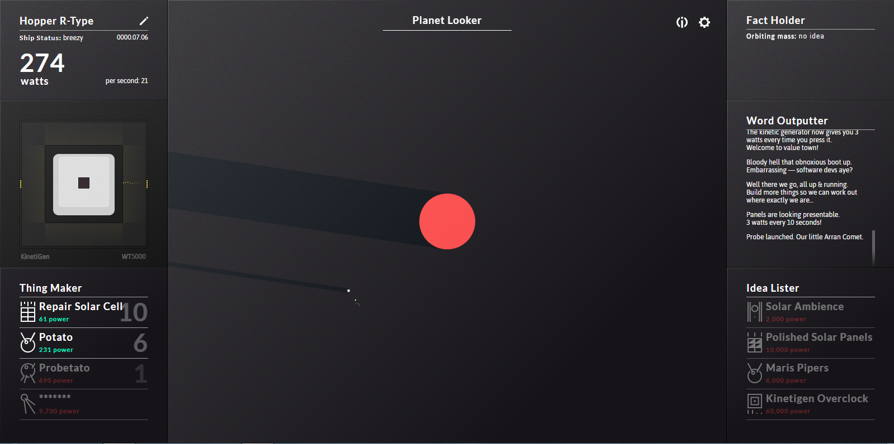

# FILEPLAN
This is a game based off the ever popular game SPACEPLAN. Please read the wiki for more info.

## [SPACEPLAN](http://jhollands.co.uk/spaceplan/)
The game [SPACEPLAN](http://jhollands.co.uk/spaceplan/) was created by Jake Hollands and the audio is by Logan Gabriel.

## How this game works
This is a clicker game so you should be able to clicker on the clicker and buy upgrades.

## Audit Score
This is the audit score for the website(as of 7/29/2017 10:39:29 PM)

## Upgrades

1. Change price on click(see #25)*
2. Add more upgrades to the idea lister(see #27)*
3. Change the Receipt(see #24)**
4. Add progress bar(see #28)**

###### * in progress
###### ** will not be done for a while

## Bugs

- Only clicker upgrades
- No sound
- No music
